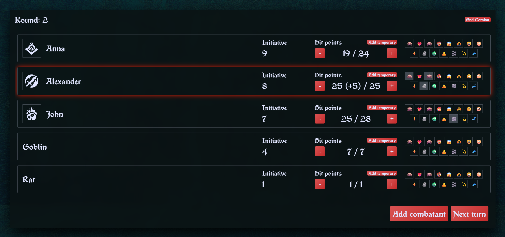
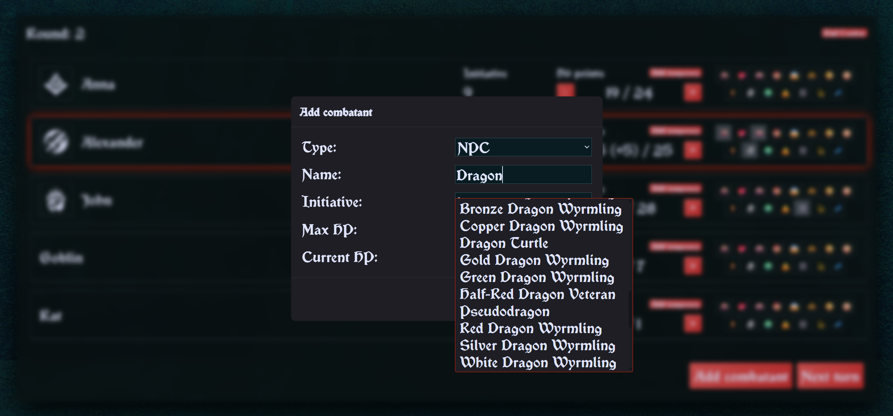
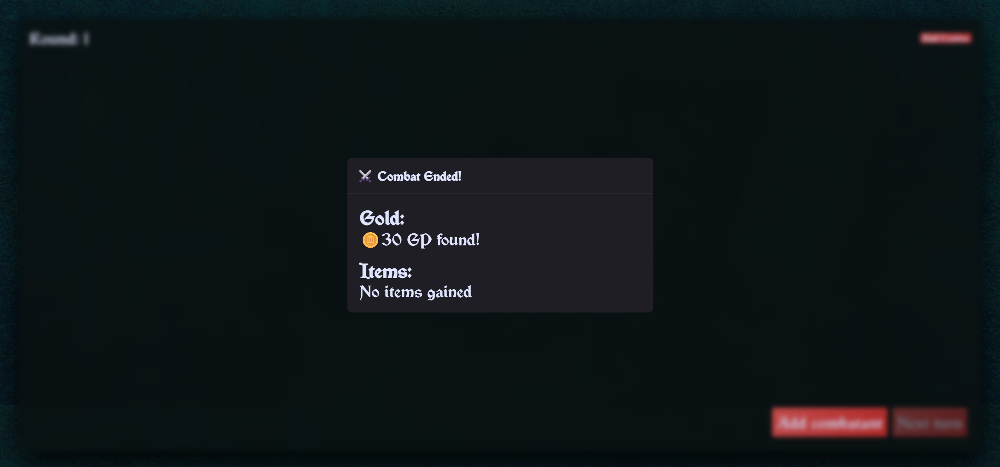

# 🧙‍♂️ Dungeon Desk

An interactive combat tracker designed for DM's to manage D&D combat encounters.

---

## ⚙️ Core Features (MVP)

### ⚔️ Combat System
* **Initiative sorting:** Automatically orders combatants by their initiative rolls.
* **Turn tracking:** Visual highlighting of the active turn with manual switching to the next combatant.
* **Combat wrap-up:** Resetting the combat state and generating random loot based on defeated NPCs.

### ❤️ HP & Condition Management
* Easy HP adjustments (+ / -).
* Quick conditions handling.
* NPC search directly from a database.

---

## 🏗️ Key Engineering Decisions

- Feature-Sliced Design architecture
- Separation of server and client state (React Query + Zustand)
- Derived state extracted into selectors
- CI pipeline with automated checks
- Type-safe architecture with strict boundaries

---

## 👾 Tech Stack & Infrastructure

* **Core & Routing:** React, React Router
* **Languages & Styling:** TypeScript, SCSS Modules
* **Build Tool:** Vite
* **State Management:** Zustand, TanStack Query
* **Testing:** Vitest
* **Automation:** GitHub Actions (CI pipeline for linting and testing), Husky (pre-commit checks for branch names and staged files)

---

## 📸 Screenshots

